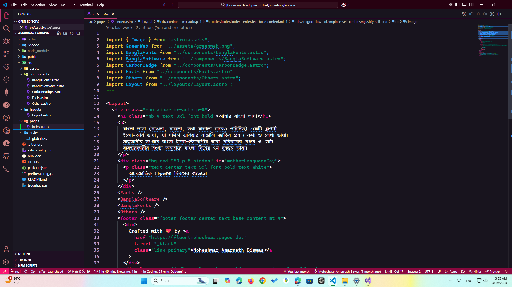
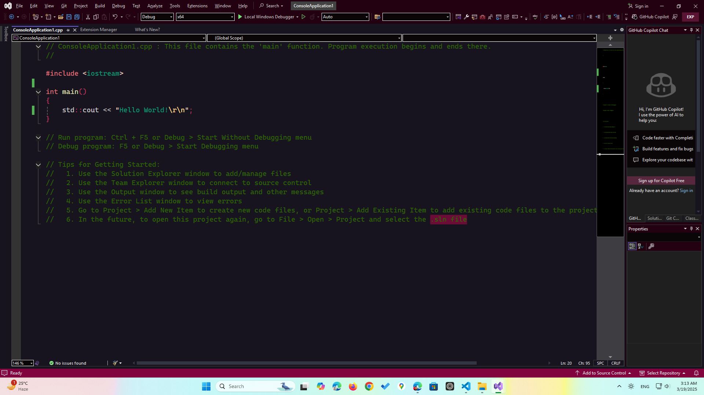

# Puja Bloom Theme

Puja Bloom is a Visual Studio / Visual Studio Code Theme designed for programmers with accessibility and cuteness in mind.

## Screenshots

### Visual Studio Code



### Visual Studio



## Install

- [Visual Studio](https://marketplace.visualstudio.com/items?itemName=fluentmoheshwar.PujaBloom)

- [Visual Studio Code](https://marketplace.visualstudio.com/items?itemName=fluentmoheshwar.puja-bloom)

- [Open VSX (for VSCodium, Project IDX, Theia, etc)](https://open-vsx.org/extension/fluentmoheshwar/puja-bloom)

## Recommended Settings

### For Visual Studio Code

```json
{
  "editor.fontFamily": "Cascadia Code, CaskaydiaCove NF, Fira Code, Noto Sans Bengali",
  "editor.smoothScrolling": true,
  "terminal.integrated.smoothScrolling": true,
  "editor.cursorBlinking": "expand",
  "editor.cursorSmoothCaretAnimation": "on",
  "workbench.list.smoothScrolling": true,
  "editor.bracketPairColorization.enabled": true,
  "editor.fontLigatures": true
}
```

## Repo Structure

### What's in the folder

- This folder contains all of the files necessary for your color theme extension.
- `package.json` - this is the manifest file that defines the location of the theme file and specifies the base theme of the theme.
- `themes/Puja Bloom.json` - the color theme definition file.
- `vs/PujaBloom/` this folder contains visual studio files

Made with ❤️ in 🇧🇩
